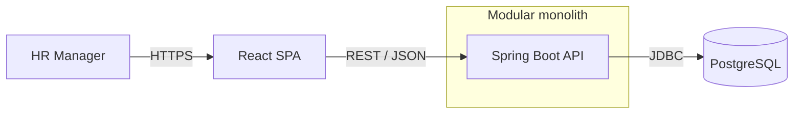
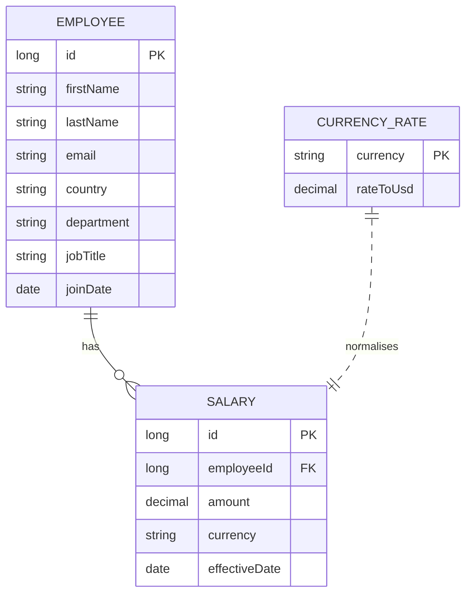
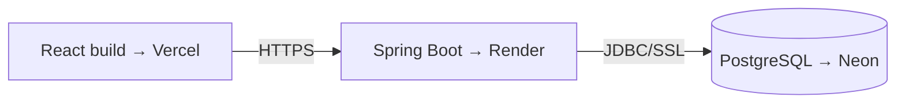

# Architecture

*How the salary management tool is built, and why. Companion to [requirements.md](requirements.md). Individual decisions are recorded as [ADRs](adr/).*

## 1. Architecture style

A **modular monolith** backend and a **single React app** frontend, kept in one **monorepo** and deployed as two units.

- **Modular monolith** — one deployable backend, internally organised **package-by-feature** (`employee`, `salary`, `insights`, `currency`) with clear layering (web → service → repository). Gives the modularity and testability people reach to microservices for, without the operational tax. See [ADR-0005](adr/0005-modular-monolith-over-microservices.md).
- **Single React app** — one dashboard-style SPA. No micro-frontends: this is one small UI built by one person.
- **Monorepo** — backend, frontend, and docs share one history so the solution's evolution reads as one story. Deployment is still split (see §7).

```
incubyte-salary-management/
├── backend/     # Spring Boot (Java)
├── frontend/    # React (Vite)
├── docs/        # requirements, architecture, ADRs, AI notes
└── docker-compose.yml
```

## 2. System overview



## 3. Domain model

Three entities. Money is compared across countries via a rates table.



- **Employee** — the person and their organisational attributes (country, department, job title) that the insights slice by.
- **Salary** — an amount in the employee's **local currency**, with an `effectiveDate`. v1 uses the single current salary per employee; the `effectiveDate` means salary **history** is a data-additive change later, not a redesign.
- **CurrencyRate** — reference data mapping each currency to a rate against the base currency (**USD**).

## 4. Money & currency normalisation — the core idea

This is the decision the whole product hinges on, so it is explicit.

- **Money is stored as `BigDecimal` with a currency code — never a floating-point number.** Floats introduce rounding error that is unacceptable for salary data.
- Salaries are held in **local currency**. Comparing or aggregating across countries (an average that mixes ₹ and $ is meaningless) requires converting to a common base.
- **All monetary aggregates convert to USD via the `CurrencyRate` table _before_ they are averaged/summed** — done in SQL at query time, from a single source of truth. Not denormalised into a stored USD column (which would go stale and add no value at this scale).

See [ADR-0003](adr/0003-currency-normalisation.md).

## 5. API design (REST / JSON)

| Method & path | Purpose |
|---|---|
| `GET /employees` | List employees — search, filter (country, department), sort, **paginated** (never returns all 10k). |
| `GET /employees/{id}` | Single employee detail. |
| `GET /insights/summary` | Total payroll cost, headcount, average & median salary (USD). |
| `GET /insights/by-country` | Per country: headcount, avg & median salary, total cost (USD). |
| `GET /insights/by-department` | Per department: same shape. |
| `GET /insights/distribution` | Salary-band histogram (count per band). |

*Nice-to-have if time allows:* `GET /insights/top-earners`, per-department pay range.

Every insight value is in the base currency. **Average and median are both reported** — median resists the skew that a few very high salaries introduce into an average, which matters for honest compensation reporting.

## 6. Persistence & data

- **PostgreSQL** everywhere ([ADR-0001](adr/0001-postgres-over-sqlite.md)); **Flyway** for versioned schema migrations.
- **Indexes** on the columns the list filters and the insights group by (`country`, `department`) — the right-sized answer to 10k rows.
- Aggregation is done in **SQL** (`GROUP BY`, `AVG`, `percentile_cont` for median), never by loading rows into the app and looping — this avoids N+1 and keeps insights fast.

## 7. Deployment topology

One repo, deployed as two units plus a managed database — all on free tiers.



- **Frontend** → Vercel (root directory `frontend/`).
- **Backend** → Render (root directory `backend/`, Docker).
- **Database** → Neon (managed Postgres, persistent free tier).
- Config flows through **environment variables** (DB URL/credentials on the backend; API base URL on the frontend); **no secrets in the repo**. Locally, `docker-compose` provides Postgres so the whole system runs with one command.

## 8. Testing strategy

TDD throughout, optimised for **fast and deterministic**:

- **Unit tests (the crown jewels)** — currency normalisation and the insight calculations are pure logic: fast, deterministic, and the highest-value place to prove correctness.
- **Web-layer tests** — MockMvc against the controllers to lock the API contract.
- **Frontend** — Vitest + React Testing Library for the key components (list filtering, dashboard rendering).
- A **fixed-seed** dataset makes data-dependent tests reproducible.

## 9. What we deliberately did *not* do

Recorded so the restraint is visible: no microservices, no micro-frontends, no authentication in v1, no salary-history tables, no live FX, no bulk import. Each is justified in the [requirements](requirements.md) or an [ADR](adr/). The guiding principle is the brief's own: **good engineering judgment over complexity.**
